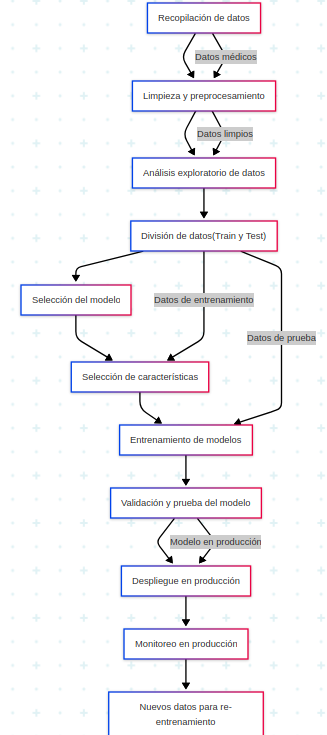

# Taller 1, Pipeline de MLOps + imagen de Docker

Este proyecto expone un servicio médico que, dado un conjunto de tres síntomas (fiebre, dolor y frecuencia cardíaca) y da como resultado:

- NO ENFERMO
- ENFERMEDAD LEVE
- ENFERMEDAD AGUDA
- ENFERMEDAD CRÓNICA

# Punto 1

El primer punto nos pedia hacer un diagrama, el archivo se puede ver en Diagrama1.1.png o Diagrama1.svg , o aqui directamente:  

  

Descripcion:

A. Recopilación de datos: Obtener los datos clinicos, como los diagnosticos y los resultados. Buscar fuentes publicas y privadas, y en especial sobre el tipo de enfermedad de interes para nosotros

B. Limpieza y preprocesamiento: Todas las tareas asociadas, como eliminar  duplicados, que hacer con valores faltantes y normalizaciòn, etc

C. Análisis exploratorio de datos: exploraciòn estadistica y visual, para tomar las deciciones posteriores

D. División de datos (Train y Test): Dividir en conjuntos de entrenamiento y prueba, para que puedan ser usados en fases posteriores

E. Selección del modelo: Se decide qué tipo de modelo de Machine Learning se usará

F. Selección de características: Se eligen las variables más relevantes

G. Entrenamiento de modelos: El modelo aprende con los datos de entrenamiento

H. Validación y prueba del modelo: Se evalúa el desempeño del modelo con los datos de prueba

I. Despliegue en producción: El modelo convierte en un servicio (como lo que hice con Flask + Docker)

J. Monitoreo en producción: Se supervisa el comportamiento del modelo mientras se usa en producción

K. Nuevos datos para re-entrenamiento: Se almacenan nuevas entradas reales y sus resultados, para seguir tuneando el modelo

# Punto 2

Nos pedian hacer una prueba sencilla con un docker

## Requisitos

- Docker
- Linux (Debian de preferencia)
- Python 3

## Comandos

```bash
# 1. Clonar el proyecto (si es necesario)
git clone https://github.com/tuusuario/predictor_app.git
cd predictor_app

# 2. Construir la imagen Docker
docker build -t predictor-app .

# 3. Ejecutar el contenedor en el puerto 5000
docker run -p 5000:5000 predictor-app

# 4. En otra terminal: Probar la API con un POST usando curl

# Ejemplo: caso crónico
curl -X POST http://localhost:5000/predecir \
     -H "Content-Type: application/json" \
     -d '{"fiebre": 38.5, "dolor": 7, "frecuencia_cardiaca": 105}'

# Tambien se puede usar postman o alguna herramienta similar
```


```bash
# 5. Detener el contenedor (buscar ID con docker ps)
docker ps
docker stop <container_id>
