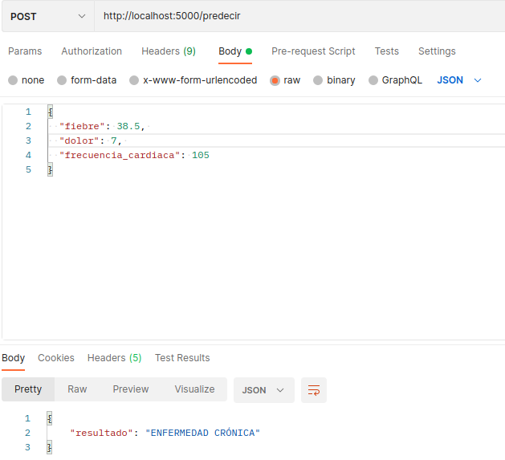

# Taller 1, Pipeline de MLOps + imagen de Docker

Este proyecto expone un servicio médico que, dado un conjunto de tres síntomas (fiebre, dolor y frecuencia cardíaca) y da como resultado:

- NO ENFERMO
- ENFERMEDAD LEVE
- ENFERMEDAD AGUDA
- ENFERMEDAD CRÓNICA

## Requisitos

- Docker
- Linux (Debian de preferencia)
- Python 3

## Comandos

```bash
# 1. Clonar el proyecto (si es necesario)
git clone https://github.com/tuusuario/predictor_app.git
cd predictor_app

# 2. Construir la imagen Docker
docker build -t predictor-app .

# 3. Ejecutar el contenedor en el puerto 5000
docker run -p 5000:5000 predictor-app

# 4. En otra terminal: Probar la API con un POST usando curl

# Ejemplo: caso crónico
curl -X POST http://localhost:5000/predecir \
     -H "Content-Type: application/json" \
     -d '{"fiebre": 38.5, "dolor": 7, "frecuencia_cardiaca": 105}'

# Ejemplo: caso leve
curl -X POST http://localhost:5000/predecir \
     -H "Content-Type: application/json" \
     -d '{"fiebre": 37.0, "dolor": 2, "frecuencia_cardiaca": 105}'

# Ejemplo: caso no enfermo
curl -X POST http://localhost:5000/predecir \
     -H "Content-Type: application/json" \
     -d '{"fiebre": 36.5, "dolor": 1, "frecuencia_cardiaca": 75}'

# Tambien se puede usar postman o alguna herramienta similar


# 5. Detener el contenedor (buscar ID con docker ps)
docker ps
docker stop <container_id>
